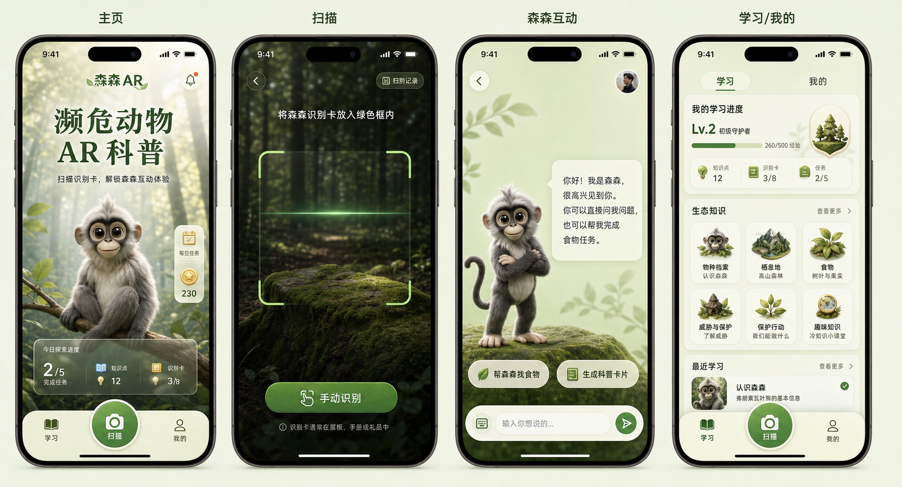

# EndangeredAR

基于增强现实、可信动物知识与端云协同 AI 的珍稀及受保护野生动物智能科普系统

[](https://unity.com/releases/editor/archive)


## 项目简介

**EndangeredAR** 是一款面向青少年科普、研学活动、动物园及自然教育场景的智能 AR 应用。项目通过 Unity 构建可交互的数字动物角色，结合本地轻量模型、云端大模型和经过审核的动物知识库，为用户提供具有真实来源引用的自然语言科普问答。

当前核心角色为缨冠灰叶猴“森森”（*Semnopithecus priam*）。系统不仅能够回答用户关于物种身份、食性、分布和保护状态的问题，还能在严格的白名单、角色能力和运行时校验下，根据明确互动意图或可信知识主题驱动角色播放相应动画。

项目坚持“模型负责表达，知识库负责事实，应用层负责权限”的设计原则。AI 可以读取有限的业务上下文，但不能直接修改任务、进度、徽章、解锁状态或动画权限。



## 核心能力

- **AR 数字动物交互**：支持角色展示、单指旋转、双指缩放和页面生命周期管理。
- **端云协同问答**：支持本地轻量模型、云端模型和确定性知识兜底路由。
- **可信动物知识**：科学事实来自 canonical 动物知识库，并返回可追踪引用。
- **事实约束与拒绝编造**：资料不足时明确说明证据不足，不虚构学名、数量、分布或保护等级。
- **安全角色动作**：AI 或知识系统只能产生动作候选，最终必须经过 Policy、Capability、Validator 和角色控制器。
- **知识驱动行为**：食性问题在真实 diet 证据和 citation 成立时，可安全触发森森的 Eat 动画。
- **只读业务上下文**：AI 可读取有限的解锁、知识、徽章和任务完成状态，但没有业务写权限。
- **真机验证**：已在 iOS 27 与 Unity 6000.0.76f1 环境完成启动、AR、手势、聊天和角色动画验收。

## 当前角色：森森

- 中文名：缨冠灰叶猴
- 学名：*Semnopithecus priam*
- 英文名：Tufted Gray Langur
- IUCN 状态：近危（Near Threatened，NT）
- 种群趋势：下降
- 全球种群总量：缺少可靠的统一估算
- CITES：附录 I

> CITES 附录 I 与 IUCN“濒危（EN）”不是同一评价体系。森森当前的 IUCN 等级是近危（NT），不能描述为 IUCN 濒危（EN）。

## 技术架构概览

```text
用户输入
  ↓
只读角色上下文 + Canonical 动物知识检索
  ↓
Local LLM / Cloud LLM / Unity Knowledge Fallback
  ↓
可信回答 + Citations + 受控动作候选
  ↓
Action Policy
  ↓
Character Capability
  ↓
AIInteractionValidator
  ↓
Rigged AR Character
```

核心原则是：**模型负责表达，知识库负责事实，应用层负责权限。** Unity 只访问项目自己的 Python 代理，Moonshot 密钥不进入客户端和 Git 历史。Local、Cloud 和 Unity 知识兜底使用同一份事实约束；模型不能决定引用、业务写入权限或直接调用 Animator。

## 技术栈

- Unity `6000.0.76f1`
- C# / Python
- iOS 27 / Xcode 27
- llama.cpp
- Qwen2.5-1.5B-Instruct GGUF（本地开发推理服务）
- Moonshot API（云端模型路径）
- JSON canonical knowledge corpus
- Unity Generic Rig / Animator
- Unity UI / TextMeshPro / glTFast `6.18.0`

当前稳定包清单未包含 AR Foundation、ARKit XR Plugin 或 ARCore XR Plugin。扫描体验使用 iOS 相机预览与手动/模拟识别兜底；真实图片追踪仍属于后续工作。

## 当前限制

- 本地轻量模型目前通过开发机上的 llama.cpp 服务运行，尚未直接内嵌到 iOS 或 Android App。
- 当前完整角色闭环主要围绕森森实现，尚未完成大规模多物种扩展。
- 森森为卡通化数字角色原型，后续仍可继续进行物种特征和美术精修。
- 当前长期角色记忆尚未实现；R3.3A 仅提供真实业务状态的只读上下文。
- 正式商业化所需的长期性能监控、隐私政策和多用户体系仍属于后续工作。


## 仓库结构

```text
.
├── EndangeredAR/               # Unity 工程
│   ├── Assets/
│   │   ├── Config/             # API 等 ScriptableObject 配置
│   │   ├── Resources/Animals/  # 动物定义、知识与任务资产
│   │   ├── Scenes/             # DemoScene
│   │   ├── Scripts/            # API、动物、进度、任务、UI
│   │   ├── StreamingAssets/    # GLB 模型与纹理
│   │   └── Tests/              # EditMode / PlayMode 测试
│   ├── Design/                 # 产品设计图
│   └── docs/                   # 设计、实施计划与验收记录
├── content/animals/            # 唯一人工维护的动物知识 JSON
├── content/quality/            # 固定质量回归问题集
└── server/                     # 本地 AI 代理和 Python 测试
```

## 快速开始

### 1. 克隆项目

```bash
git clone https://github.com/David6-cpu/EndangeredAR.git
cd EndangeredAR
```

> 仓库包含较大的 GLB 模型，首次克隆需要一些时间。

### 2. 打开 Unity Demo

1. 使用 Unity Hub 安装并打开 Unity `6000.0.76f1`。
2. 在 Unity Hub 中选择仓库内的 `EndangeredAR/` 目录。
3. 打开 `Assets/Scenes/DemoScene.unity`。
4. 等待脚本编译和资源导入完成后进入 Play Mode。

请直接使用已经审查和验证过的 `DemoScene`。除非你明确要重新生成场景，否则不要运行 `Endangered AR > Build Demo Scene`，因为该菜单会重建场景内容。

### 3. 启动 AI 服务

仅使用云端或 Unity 知识兜底时，项目不需要第三方 Python 包：

```bash
cp server/.env.example .env.local
# 在 .env.local 中填写 MOONSHOT_API_KEY；不配置也可使用本地知识兜底
python3 server/dev_server.py
```

健康检查：

```bash
curl http://127.0.0.1:8000/health
```

预期输出：

```json
{"status": "ok"}
```

要启用本地模型，先在另一个终端启动一个 OpenAI-compatible llama.cpp 服务：

```bash
llama-server \
  -m "<path-to-qwen-gguf>" \
  --host 127.0.0.1 \
  --port 8080
```

然后确认 `.env.local` 包含：

```dotenv
LOCAL_LLM_BASE_URL=http://127.0.0.1:8080/v1
LOCAL_LLM_MODEL=
LOCAL_LLM_TIMEOUT=7
```

`LOCAL_LLM_MODEL` 可留空；是否需要模型名取决于所使用的兼容服务。完整启动、接口调用和故障排查见 [`server/README.md`](server/README.md)。

Unity 的默认路由仍是 `CloudOnly`。在 `EndangeredAR/Assets/Config/LocalAIConfig.asset` 中可选择 `CloudOnly`、`LocalOnly` 或 `LocalFirstCloudFallback`。Unity Editor 的本地服务地址和云端代理地址都可使用 `http://127.0.0.1:8000`。

iPhone 真机中的 `localhost` 指向手机自身，因此 `LocalAIConfig.localServerUrl` 和现有 `LocalApiConfig.baseUrl` 都必须填写开发电脑在同一局域网内可达的地址，例如 `http://192.168.1.20:8000`。Python 代理仍可通过 Mac 自己的 `127.0.0.1:8080` 访问 llama.cpp。现有菜单可设置 `LocalApiConfig` 的云端代理地址：

```text
Endangered AR > Set Local API To Mac LAN IP
```

该菜单当前不会同步更新 `LocalAIConfig.localServerUrl`；使用本地路由进行真机测试前，请在 Inspector 中单独填写同一个 Mac 局域网地址。

生产环境应将代理部署到 HTTPS 服务，不应依赖开发电脑的局域网地址。

### 4. 构建 iOS

1. 在 Unity 中选择 `Endangered AR > Build iOS Xcode Project`。
2. 使用 Xcode 打开生成的 `Unity-iPhone.xcodeproj`。
3. 配置自己的开发团队和 Bundle Identifier。
4. 连接已信任且开启开发者模式的 iPhone，签名并运行。

Unity 6000.0.76f1 生成的 iOS 工程包含当前系统所需的 `UIScene` 生命周期支持，并已在 iOS 27 真机完成正常启动验收。

## AI 配置与安全

`.env.local` 的格式来自 [`server/.env.example`](server/.env.example)：

```dotenv
MOONSHOT_API_KEY=
MOONSHOT_BASE_URL=https://api.moonshot.cn/v1
MOONSHOT_MODEL=moonshot-v1-8k
LOCAL_LLM_BASE_URL=http://127.0.0.1:8080/v1
LOCAL_LLM_MODEL=
LOCAL_LLM_TIMEOUT=7
```

- `.env.local` 已被 `.gitignore` 排除，**不要提交真实密钥**。
- Unity 客户端不保存 Moonshot Key，也不发送 `Authorization: Bearer` 到供应商。
- `CloudOnly`：Python `/chat` → Moonshot；Moonshot 不可用时保持现有 Python 规则回答；代理不可达时使用 Unity 知识兜底。
- `LocalOnly`：Python `/chat/local` → llama.cpp；失败后直接使用 Unity 知识兜底，绝不访问 Cloud。
- `LocalFirstCloudFallback`：先尝试本地模型，再使用剩余预算请求 `/chat`，最后使用 Unity 知识兜底。
- `source` 标识实际答案来源（如 `local_llm`、`cloud_llm`、`server_rule`、`unity_knowledge`），`routeReason` 标识命中的路由路径。
- `answerMode` 区分 `grounded_fact`、`social_chat` 和 `off_domain`；`evidenceStatus` 区分有证据、证据不足和无需证据。
- `citations` 由应用根据检索结果生成，包含稳定 `sourceId`、标题、机构和 URL；模型输出中的伪造引用不会进入响应。
- 森森唯一人工维护知识源是 [`content/animals/sensen.json`](content/animals/sensen.json)。Unity 的 `Sensen.asset` 与 `SensenKnowledge.asset` 由 `AnimalContentAssetBuilder` 从该文件生成，不应手工维护第二份事实。
- 默认预算为本地 8 秒、整条 Provider 路由 38 秒；聊天 UI 另有 40 秒总保护，不会让 Local 与 Cloud 各自等待完整 40 秒。
- 后端最多保留请求中最近 20 条受支持的用户/角色消息。
- 当前知识系统使用小型确定性检索，不包含向量数据库、Embedding、流式输出或移动端原生推理。角色动作只能由应用生成候选并经过 Policy、Capability、Validator 和角色控制器，模型不能直接控制动画或任务。

更完整的后端说明见 [`server/README.md`](server/README.md)。

## 测试与验证

### 后端测试

```bash
python3 -m unittest discover -s server/tests -v
```

### Unity EditMode

```bash
UNITY="${UNITY_EDITOR:?Set UNITY_EDITOR to the Unity executable}"
mkdir -p TestResults
"$UNITY" -batchmode -nographics \
  -projectPath "$PWD/EndangeredAR" \
  -runTests -testPlatform EditMode \
  -testResults "$PWD/TestResults/endangeredar-editmode.xml" \
  -logFile "$PWD/TestResults/endangeredar-editmode.log"
```

### Unity PlayMode

```bash
"$UNITY" -batchmode -nographics \
  -projectPath "$PWD/EndangeredAR" \
  -runTests -testPlatform PlayMode \
  -testResults "$PWD/TestResults/endangeredar-playmode.xml" \
  -logFile "$PWD/TestResults/endangeredar-playmode.log"
```

最近一次完整回归记录：

| 验证项 | 结果 |
| --- | ---: |
| Unity EditMode | 332 / 332 passed |
| Unity PlayMode | 33 / 33 passed |
| Python backend | 74 / 74 passed |
| iOS 构建 | Unity 6 导出、Xcode 签名构建与真机安装成功 |
| 真机范围 | iOS 27 启动、Safe Area、相机、Rigged 角色、手势、聊天与动作验收 |

真机构建背景、设备检查项和已知边界见 [`Sensen iPhone Device Acceptance`](EndangeredAR/docs/verification/2026-08-06-sensen-device-acceptance.md)。自动化测试不能替代相机比例、模型材质、手势、PNG 输出等真机人工检查。

## 已知问题与发布边界

- 扫描页提供相机预览与手动/模拟识别；真实图片追踪尚未恢复。
- AI 代理当前适合本地开发和竞赛展示，不是生产级账号或高并发后台。
- iOS App Store 发布前仍需准备正式应用图标、隐私文案、生产 HTTPS 地址和分发配置。
- 第二动物模型资源已进入仓库，但角色内容、任务、识别映射和完整真机验收尚未完成。

## Roadmap

1. 完成第二动物的数据资产、独立任务、角色 Prompt 和模型验收。
2. 将扫描解锁与图鉴入口扩展为真正的多动物选择闭环。
3. 为第二动物建立同一 Canonical Knowledge Schema，并先完成来源核验再录入事实。
4. 部署公开 HTTPS AI 代理，移除局域网演示依赖。
5. 在稳定包基线之上评估恢复 ARFoundation 图片追踪。
6. 完成 App Store 图标、隐私清单、性能与长时间真机测试。

## 参与项目

欢迎通过 Issue 提交以下内容：

- 濒危动物资料校对与保护行动建议
- Unity 移动端适配问题
- 新动物的低面数、授权清晰的 3D 模型建议
- 科普任务和青少年交互体验改进

提交代码前请确保不包含 API Key、签名文件、个人路径、Unity `Library/` 或构建产物，并至少运行与改动相关的测试。

## 许可与素材

仓库目前尚未添加开源许可证，因此默认保留所有权利。代码、字体、图片和 3D 模型可能具有不同的授权来源；在复用、再发布或商业使用前，请分别确认对应素材的许可条件。后续会在整理模型来源和第三方声明后补充正式的 `LICENSE` 与素材清单。

## 文档

- [产品与多动物架构设计](EndangeredAR/docs/superpowers/specs/2026-07-18-multi-animal-product-design.md)
- [森森稳定基线](EndangeredAR/docs/verification/2026-07-19-sensen-baseline.md)
- [iPhone 真机验收记录](EndangeredAR/docs/verification/2026-08-06-sensen-device-acceptance.md)
- [R1 端云协同 AI 验收说明](EndangeredAR/docs/verification/2026-08-21-r1-hybrid-ai-routing.md)
- [R2 Grounded Animal Knowledge 验收说明](EndangeredAR/docs/verification/2026-08-21-r2-grounded-animal-knowledge.md)
- [R3.3A Read-only Context 验收说明](EndangeredAR/docs/verification/2026-08-24-r3.3a-readonly-context-foundation.md)
- [UI Design System](EndangeredAR/DESIGN.md)

---

这个项目仍在持续开发。当前目标不是堆叠功能，而是把每个动物都做成一条可信、可互动、可学习、可验证的完整体验。
