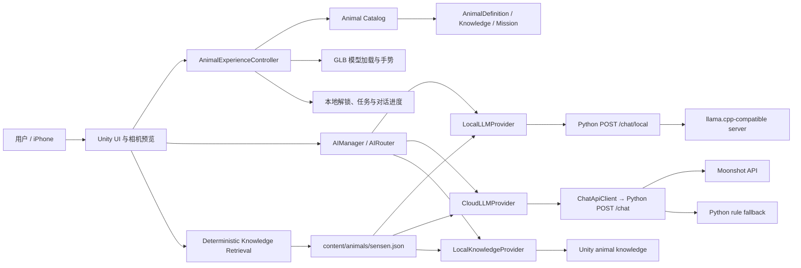

# 濒危动物交互科普系统 EndangeredAR

> A Unity mobile experience where rare and protected wildlife can be discovered, understood, and spoken with.

[](https://unity.com/releases/editor/whats-new/2022.3.62)


**EndangeredAR** 是一款面向青少年科普与竞赛展示的珍稀及受保护野生动物互动产品。用户通过相机扫描入口认识动物，在 3D 场景中旋转、缩放动物模型，与角色化 AI 对话，完成轻量科普任务，并生成可保存的学习卡片。

当前已经完成并经过 iPhone 真机验证的主角是缨冠灰叶猴 **“森森”**。项目同时建立了数据驱动的多动物基础，但第二个动物体验仍在开发中。


## 核心体验

```text
进入 App → 相机扫描入口 → 识别/手动确认 → 森森 3D 模型出现
        → 角色化 AI 对话 → 帮森森寻找食物 → 解锁徽章
        → 生成科普卡片 PNG → 图鉴与进度持久化
```

| 能力 | 当前实现 |
| --- | --- |
| 动物展示 | 森森 GLB 模型、材质加载、出现反馈、双指缩放和单指旋转 |
| 扫描体验 | iOS 相机预览、扫描框、手动/模拟识别兜底；稳定版暂未启用 ARFoundation 图像追踪 |
| AI 对话 | Unity 可切换 CloudOnly、LocalOnly、LocalFirstCloudFallback；科学事实先检索项目知识并携带真实引用，再由本机 llama.cpp 或 Moonshot 提供角色表达 |
| 科普任务 | “帮森森寻找食物”选择任务，区分正确/错误反馈并避免重复发放奖励 |
| 学习闭环 | 学习中心、动物解锁进度、徽章、图鉴、科普卡片 PNG |
| 移动端适配 | Safe Area、Dynamic Island、Home Indicator、iPhone 竖屏布局 |
| 多动物基础 | 数据驱动的动物定义、模型加载、知识、任务、进度和 Marker 映射 |

## 项目亮点

- **角色化科普**：森森以第一人称、青少年友好的语气回答，不是普通百科问答框。
- **AI 安全边界**：大模型密钥只存在于后端环境变量，Unity 客户端不直连模型供应商。
- **完整互动闭环**：展示、对话、任务、奖励、学习卡片和持久化不是彼此割裂的页面。
- **离线可演示**：云端不可用时仍能使用本地动物知识回答，避免现场演示中断。
- **面向扩展**：动物内容从角色、模型、知识、任务到进度均按 `animalId` 隔离。

## 系统架构



核心原则是：**Unity 只访问项目自己的 Python 代理；Moonshot 密钥永远不进入客户端和 Git 历史。** `/chat/local` 代理本机 llama.cpp-compatible 服务，`/chat` 保留 Moonshot 路径。两条 Provider 路径在科学事实问题上使用同一份确定性检索证据，模型不能决定事实正文或引用。

## 技术栈

- Unity `2022.3.62f3c1`
- Unity UI / TextMeshPro
- glTFast `6.18.0`
- C#、NUnit、Unity Test Framework
- Python 3 标准库 HTTP Server
- Moonshot OpenAI-compatible API（可选）
- Xcode / iOS 15+

稳定分支目前**没有启用** AR Foundation、ARKit XR Plugin 或 ARCore XR Plugin，以避免重新引入此前的 Unity 包冲突。真实 AR 图片追踪属于后续阶段，不是当前 README 所描述的已完成功能。

## 仓库结构

```text
.
├── EndangeredAR/               # Unity 工程
│   ├── Assets/
│   │   ├── Config/             # API 等 ScriptableObject 配置
│   │   ├── Resources/Animals/  # 动物定义、知识与任务资产
│   │   ├── Scenes/             # DemoScene
│   │   ├── Scripts/            # API、动物、进度、任务、UI
│   │   ├── StreamingAssets/    # GLB 模型与纹理
│   │   └── Tests/              # EditMode / PlayMode 测试
│   ├── Design/                 # 产品设计图
│   └── docs/                   # 设计、实施计划与验收记录
├── content/animals/            # 唯一人工维护的动物知识 JSON
├── content/quality/            # 固定质量回归问题集
└── server/                     # 本地 AI 代理和 Python 测试
```

## 快速开始

### 1. 克隆项目

```bash
git clone https://github.com/David6-cpu/EndangeredAR.git
cd EndangeredAR
```

> 仓库包含较大的 GLB 模型，首次克隆需要一些时间。

### 2. 打开 Unity Demo

1. 使用 Unity Hub 安装并打开 Unity `2022.3.62f3c1`。
2. 在 Unity Hub 中选择仓库内的 `EndangeredAR/` 目录。
3. 打开 `Assets/Scenes/DemoScene.unity`。
4. 等待脚本编译和资源导入完成后进入 Play Mode。

请直接使用已经审查和验证过的 `DemoScene`。除非你明确要重新生成场景，否则不要运行 `Endangered AR > Build Demo Scene`，因为该菜单会重建场景内容。

### 3. 启动 AI 服务

仅使用云端或 Unity 知识兜底时，项目不需要第三方 Python 包：

```bash
cp server/.env.example .env.local
# 在 .env.local 中填写 MOONSHOT_API_KEY；不配置也可使用本地知识兜底
python3 server/dev_server.py
```

健康检查：

```bash
curl http://127.0.0.1:8000/health
```

预期输出：

```json
{"status": "ok"}
```

要启用本地模型，先在另一个终端启动一个 OpenAI-compatible llama.cpp 服务：

```bash
llama-server \
  -m /absolute/path/to/model.gguf \
  --host 127.0.0.1 \
  --port 8080
```

然后确认 `.env.local` 包含：

```dotenv
LOCAL_LLM_BASE_URL=http://127.0.0.1:8080/v1
LOCAL_LLM_MODEL=
LOCAL_LLM_TIMEOUT=7
```

`LOCAL_LLM_MODEL` 可留空；是否需要模型名取决于所使用的兼容服务。完整启动、接口调用和故障排查见 [`server/README.md`](server/README.md)。

Unity 的默认路由仍是 `CloudOnly`。在 `EndangeredAR/Assets/Config/LocalAIConfig.asset` 中可选择 `CloudOnly`、`LocalOnly` 或 `LocalFirstCloudFallback`。Unity Editor 的本地服务地址和云端代理地址都可使用 `http://127.0.0.1:8000`。

iPhone 真机中的 `localhost` 指向手机自身，因此 `LocalAIConfig.localServerUrl` 和现有 `LocalApiConfig.baseUrl` 都必须填写开发电脑在同一局域网内可达的地址，例如 `http://192.168.1.20:8000`。Python 代理仍可通过 Mac 自己的 `127.0.0.1:8080` 访问 llama.cpp。现有菜单可设置 `LocalApiConfig` 的云端代理地址：

```text
Endangered AR > Set Local API To Mac LAN IP
```

该菜单当前不会同步更新 `LocalAIConfig.localServerUrl`；使用本地路由进行真机测试前，请在 Inspector 中单独填写同一个 Mac 局域网地址。

生产环境应将代理部署到 HTTPS 服务，不应依赖开发电脑的局域网地址。

### 4. 构建 iOS

1. 在 Unity 中选择 `Endangered AR > Build iOS Xcode Project`。
2. 使用 Xcode 打开生成的 `Unity-iPhone.xcodeproj`。
3. 配置自己的开发团队和 Bundle Identifier。
4. 连接已信任且开启开发者模式的 iPhone，签名并运行。

项目的 Unity 后处理步骤包含 Unity 2022 对新 iOS `UIScene` 生命周期的兼容处理。当前开发构建最低目标为 iOS 15。

## AI 配置与安全

`.env.local` 的格式来自 [`server/.env.example`](server/.env.example)：

```dotenv
MOONSHOT_API_KEY=
MOONSHOT_BASE_URL=https://api.moonshot.cn/v1
MOONSHOT_MODEL=moonshot-v1-8k
LOCAL_LLM_BASE_URL=http://127.0.0.1:8080/v1
LOCAL_LLM_MODEL=
LOCAL_LLM_TIMEOUT=7
```

- `.env.local` 已被 `.gitignore` 排除，**不要提交真实密钥**。
- Unity 客户端不保存 Moonshot Key，也不发送 `Authorization: Bearer` 到供应商。
- `CloudOnly`：Python `/chat` → Moonshot；Moonshot 不可用时保持现有 Python 规则回答；代理不可达时使用 Unity 知识兜底。
- `LocalOnly`：Python `/chat/local` → llama.cpp；失败后直接使用 Unity 知识兜底，绝不访问 Cloud。
- `LocalFirstCloudFallback`：先尝试本地模型，再使用剩余预算请求 `/chat`，最后使用 Unity 知识兜底。
- `source` 标识实际答案来源（如 `local_llm`、`cloud_llm`、`server_rule`、`unity_knowledge`），`routeReason` 标识命中的路由路径。
- `answerMode` 区分 `grounded_fact`、`social_chat` 和 `off_domain`；`evidenceStatus` 区分有证据、证据不足和无需证据。
- `citations` 由应用根据检索结果生成，包含稳定 `sourceId`、标题、机构和 URL；模型输出中的伪造引用不会进入响应。
- 森森唯一人工维护知识源是 [`content/animals/sensen.json`](content/animals/sensen.json)。Unity 的 `Sensen.asset` 与 `SensenKnowledge.asset` 由 `AnimalContentAssetBuilder` 从该文件生成，不应手工维护第二份事实。
- 默认预算为本地 8 秒、整条 Provider 路由 38 秒；聊天 UI 另有 40 秒总保护，不会让 Local 与 Cloud 各自等待完整 40 秒。
- 后端最多保留请求中最近 20 条受支持的用户/角色消息。
- 当前 R2 使用小型确定性检索，不包含向量数据库、Embedding、流式输出、移动端原生推理或 AI 动画/任务控制。

更完整的后端说明见 [`server/README.md`](server/README.md)。

## 测试与验证

### 后端测试

```bash
python3 -m unittest discover -s server/tests -v
```

### Unity EditMode

```bash
UNITY="/Applications/Unity/Hub/Editor/2022.3.62f3c1/Unity.app/Contents/MacOS/Unity"
"$UNITY" -batchmode -nographics \
  -projectPath "$PWD/EndangeredAR" \
  -runTests -testPlatform EditMode \
  -testResults /tmp/endangeredar-editmode.xml \
  -logFile /tmp/endangeredar-editmode.log
```

### Unity PlayMode

```bash
"$UNITY" -batchmode -nographics \
  -projectPath "$PWD/EndangeredAR" \
  -runTests -testPlatform PlayMode \
  -testResults /tmp/endangeredar-playmode.xml \
  -logFile /tmp/endangeredar-playmode.log
```

最近一次完整回归记录：

| 验证项 | 结果 |
| --- | ---: |
| Unity EditMode | 136 / 136 passed |
| Unity PlayMode | 13 / 13 passed |
| Python backend | 54 / 54 passed |
| iOS 构建 | Unity 导出、Xcode 签名构建与真机安装成功 |
| 真机目标 | iPhone 17 Pro Max，竖屏 Safe Area 验证 |

真机构建背景、设备检查项和已知边界见 [`Sensen iPhone Device Acceptance`](EndangeredAR/docs/verification/2026-08-06-sensen-device-acceptance.md)。自动化测试不能替代相机比例、模型材质、手势、PNG 输出等真机人工检查。

## 当前边界

- 森森是当前唯一完整跑通的动物体验。
- 扫描页提供相机预览与手动/模拟识别；真实图片追踪尚未恢复。
- AI 代理当前是适合本地开发和竞赛展示的轻量服务，不是生产级账号或高并发后台；本地模型仍运行在开发电脑上，不在 iPhone/Android 包内。
- iOS App Store 发布前仍需准备正式应用图标、隐私文案、生产 HTTPS 地址和分发配置。
- 第二动物体验尚未随稳定分支交付；角色内容、模型资源、任务、识别映射和完整真机验收应在后续独立分支中补齐。

## Roadmap

1. 完成第二动物的数据资产、独立任务、角色 Prompt 和模型验收。
2. 将扫描解锁与图鉴入口扩展为真正的多动物选择闭环。
3. 为第二动物建立同一 Canonical Knowledge Schema，并先完成来源核验再录入事实。
4. 部署公开 HTTPS AI 代理，移除局域网演示依赖。
5. 在稳定包基线之上评估恢复 ARFoundation 图片追踪。
6. 完成 App Store 图标、隐私清单、性能与长时间真机测试。

## 参与项目

欢迎通过 Issue 提交以下内容：

- 濒危动物资料校对与保护行动建议
- Unity 移动端适配问题
- 新动物的低面数、授权清晰的 3D 模型建议
- 科普任务和青少年交互体验改进

提交代码前请确保不包含 API Key、签名文件、个人路径、Unity `Library/` 或构建产物，并至少运行与改动相关的测试。

## 许可与素材

仓库目前尚未添加开源许可证，因此默认保留所有权利。代码、字体、图片和 3D 模型可能具有不同的授权来源；在复用、再发布或商业使用前，请分别确认对应素材的许可条件。后续会在整理模型来源和第三方声明后补充正式的 `LICENSE` 与素材清单。

## 文档

- [产品与多动物架构设计](EndangeredAR/docs/superpowers/specs/2026-07-18-multi-animal-product-design.md)
- [森森稳定基线](EndangeredAR/docs/verification/2026-07-19-sensen-baseline.md)
- [iPhone 真机验收记录](EndangeredAR/docs/verification/2026-08-06-sensen-device-acceptance.md)
- [R1 端云协同 AI 验收说明](EndangeredAR/docs/verification/2026-08-21-r1-hybrid-ai-routing.md)
- [R2 Grounded Animal Knowledge 验收说明](EndangeredAR/docs/verification/2026-08-21-r2-grounded-animal-knowledge.md)
- [UI Design System](EndangeredAR/DESIGN.md)

---

这个项目仍在持续开发。当前目标不是堆叠功能，而是把每个动物都做成一条可信、可互动、可学习、可验证的完整体验。
